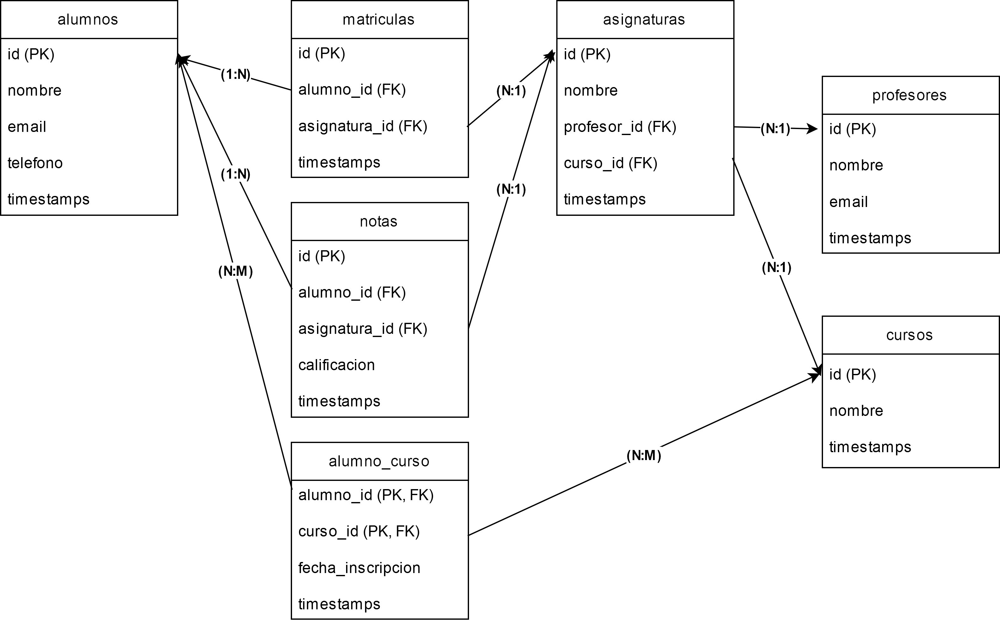

# 📌 Proyecto: Gestión de Notas - IG Formación

Este es un proyecto desarrollado en **Laravel 10** con **Docker** y **MariaDB**, que permite gestionar **alumnos, profesores, asignaturas, cursos, matrículas y notas** en un sistema de gestión educativa. 

Incluye una API REST completa con **validaciones, datos de prueba y documentación** para su despliegue y uso.

---

## 📖 Descripción del Problema

El proyecto se desarrolla para **IG Formación**, una escuela privada de formación profesional situada en Alicante, que imparte los cursos de **Desarrollo de Aplicaciones Multiplataforma** y **Desarrollo de Aplicaciones Web**.

El problema identificado es la **falta de un sistema digitalizado** para la gestión académica. Actualmente, la escuela enfrenta dificultades en:
- El registro y administración de **alumnos**.
- La gestión de **profesores** y sus asignaturas.
- La administración de **cursos**.
- El proceso de **matriculación de alumnos en asignaturas**.
- La **evaluación y consulta de notas**, incluyendo cálculo de promedios y porcentaje de aprobados.

El sistema desarrollado **automatiza estas tareas**, permitiendo una gestión eficiente y organizada.

---

## ⚙️ Tecnologías Utilizadas

- **Docker** (Contenedorización del proyecto) → [Descargar Docker](https://www.docker.com/products/docker-desktop/)
- **Postman** (Para pruebas de la API) → [Descargar Postman](https://www.postman.com/downloads/)

**Nota:** Laravel, MariaDB, Composer y PHP **ya están incluidos dentro de Docker**, por lo que no es necesario instalarlos manualmente.

---

## 🚀 Instalación y Configuración

### 1️⃣ **Clonar el Repositorio**

```bash
git clone https://github.com/Tallulah88/UD3.git
cd UD3
```

### 2️⃣ **Levantar el Proyecto con Docker**
```bash
docker-compose up -d --build
```
Este comando iniciará **Laravel, MariaDB y Nginx** automáticamente.  
También **creará automáticamente el archivo `.env`**, generará la clave de la aplicación y ejecutará las migraciones con seeders.

### 3️⃣ **Ejecutar Migraciones y Seeders** (Opcional)

Las migraciones y seeders se ejecutan automáticamente debido al script `entrypoint.sh`. Si deseas hacerlo manualmente, puedes utilizar el siguiente comando:

```bash
docker exec -it laravel_app php artisan migrate:fresh --seed
```

Esto **creará todas las tablas necesarias** y las llenará con datos de prueba mediante los **seeders**.

### 4️⃣ **Acceder a la Aplicación**

🔗 API Base URL: [http://127.0.0.1:8000/api/](http://127.0.0.1:8000/api/)

Para acceder a la base de datos en el contenedor MariaDB:
```bash
docker exec -it mariadb mysql -u laravel -psecret ig_formacion
```

---

## 📌 Modelo Entidad-Relación (E-R)

El proyecto sigue la siguiente estructura de base de datos:



Este diagrama muestra las entidades principales del sistema y sus relaciones:
- **Alumnos, Profesores, Cursos, Asignaturas, Matrículas y Notas**.
- Relaciones **1:N**, **N:M**, **relación ternaria (Alumno-Asignatura-Nota)**.
- Relación de **agregación** con la entidad **Curso**.

---

## 📡 Rutas de la API

### 📍 Alumnos
| Método | Endpoint              | Descripción                 |
|--------|----------------------|-----------------------------|
| GET    | /api/alumnos         | Obtener todos los alumnos   |
| GET    | /api/alumnos/{id}    | Obtener un alumno por ID    |
| POST   | /api/alumnos         | Crear un nuevo alumno       |
| PUT    | /api/alumnos/{id}    | Actualizar un alumno        |
| DELETE | /api/alumnos/{id}    | Eliminar un alumno          |

### 📍 Profesores
| Método | Endpoint               | Descripción                   |
|--------|-----------------------|-------------------------------|
| GET    | /api/profesores       | Obtener todos los profesores  |
| GET    | /api/profesores/{id}  | Obtener un profesor por ID    |
| POST   | /api/profesores       | Crear un nuevo profesor       |
| PUT    | /api/profesores/{id}  | Actualizar un profesor        |
| DELETE | /api/profesores/{id}  | Eliminar un profesor          |

### 📍 Asignaturas
| Método | Endpoint                | Descripción                     |
|--------|------------------------|---------------------------------|
| GET    | /api/asignaturas       | Obtener todas las asignaturas  |
| GET    | /api/asignaturas/{id}  | Obtener una asignatura por ID  |
| POST   | /api/asignaturas       | Crear una nueva asignatura     |
| PUT    | /api/asignaturas/{id}  | Actualizar una asignatura      |
| DELETE | /api/asignaturas/{id}  | Eliminar una asignatura        |

### 📍 Cursos y Matrículas
| Método | Endpoint                          | Descripción                              |
|--------|----------------------------------|------------------------------------------|
| GET    | /api/cursos                      | Obtener todos los cursos                 |
| GET    | /api/cursos/{curso}/alumnos      | Obtener alumnos inscritos en un curso    |
| POST   | /api/cursos/{curso}/alumnos/{alumno} | Asignar un alumno a un curso         |
| DELETE | /api/cursos/{curso}/alumnos/{alumno} | Eliminar un alumno de un curso       |

### 📍 Relaciones entre Alumnos y Asignaturas
| Método | Endpoint                                | Descripción                             |
|--------|--------------------------------------|-----------------------------------------|
| GET    | /api/asignaturas/{asignatura}/alumnos | Obtener los alumnos de una asignatura  |
| POST   | /api/asignaturas/{asignatura}/alumnos/{alumno} | Inscribir un alumno en una asignatura  |
| DELETE | /api/asignaturas/{asignatura}/alumnos/{alumno} | Eliminar la inscripción de un alumno en una asignatura |

---

## 🛠️ Pruebas con Postman

Para probar la API, importa el archivo Postman:

📥 **UD3.postman_collection.json**:
1. Abre Postman y ve a Importar.
2. Selecciona el archivo `.json`.
3. Prueba los endpoints con los datos de prueba.
